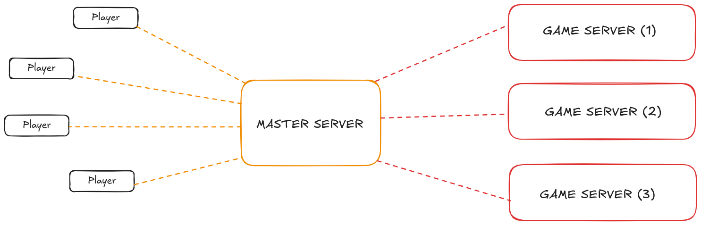

# R-Type ECS Documentation

## Overview

This repository contains an Entity Component System (ECS) framework for game development, designed to manage entities
and components in a memory-efficient, scalable manner. In this ECS, entities represent unique game objects, components
store data for entities, and systems apply logic to entities that possess specific component combinations.

### Key Concepts

* Entities: Unique identifiers for game objects, which contain no data themselves.
* Components: Data containers associated with entities, defining properties and characteristics (e.g., position,
  velocity).
* Systems: Logic processors that operate on entities with specific components, iterating over matching entities to
  perform updates.

The ECS provides flexibility, as new behaviors can be introduced simply by creating new components and systems without
modifying the entity or component structure.

## Project Structure

The key classes in this ECS are:

* **Entity**: Represents an object in the game world, with no intrinsic properties.
* **Registry**: Manages entities and components, handles tagging, layering, and grouping of entities by their components.
* **SparseSet**: Efficiently maps components to entities, optimizing memory usage.
* **EventManager**: Manages events within the ECS, allowing communication between components and systems.

### ECS Flow Diagram

Below is a conceptual diagram showing the relationships between entities, components, and systems in this ECS.



## Getting Started

### 1. Add Components

Components are simple data structures that define the properties of entities. To add a new component:

* Create a new component class (e.g., `Position`, `Velocity`) in the `components.hpp` file or as individual files.
* Register the component type in the Registry class using `registry.add<ComponentType>();`.

```cpp
struct Position {
    float x, y;
};

struct Velocity {
    float dx, dy;
};
```

### 2. Create and Manage Entities

To create and manage entities:

* Use `createEntity()` to instantiate a new entity.
* Use `tagEntity()` to assign tags to entities for easy lookup, and `setEntityLayer()` to assign layers.

```cpp
ecs::Registry registry;
ecs::Entity player = registry.createEntity();
registry.tagEntity(player, "Player");
```

### 3. Assign Components to Entities

Attach components to entities using the `set()` method:

```cpp
registry.set<Position>(player, {0.0f, 0.0f});
registry.set<Velocity>(player, {1.0f, 1.0f});
```

Use `tryGet()` to retrieve a component and modify its data:

```cpp
Position &pos = registry.tryGet<Position>(player);
pos.x += 1.0f;
pos.y += 1.0f;
```

### 4. Implement Systems

Systems define the behavior of entities with specific components. For example, create a system to update positions based
on velocity:

```cpp
void updateMovement(ecs::Registry &registry) {
    registry.forEach<Position, Velocity>([](ecs::Entity, Position &pos, Velocity &vel) {
        pos.x += vel.dx;
        pos.y += vel.dy;
    });
}
```

Then, call this function in your game loop to apply the system’s logic:

```cpp
while (gameIsRunning) {
    updateMovement(registry);
    // Other systems...
}
```

### 5. Handling Events (Optional)

Use the `EventManager` to dispatch and listen to events, which can trigger specific logic when entities interact or states
change. Here’s an example of setting up an event listener:

```cpp
registry.eventManager->subscribe<EventType>([](const EventType &event) {
    // Handle the event
});


registry.eventManager->emit(EventType{ /* Event data */ });
```

## API Reference

### Entity Management

* `createEntity()`: Creates a new entity.
* `flagEntity(Entity)`: Flags an entity for deletion.
* `deleteFlaggedEntities()`: Deletes all flagged entities.
* `tagEntity(Entity, std::string)`: Tags an entity.
* `getEntityByTag(std::string)`: Gets an entity by its tag.

### Component Management

* `add<T>()`: Registers a new component type T.
* `set<T>(Entity, T)`: Assigns a component of type T to an entity.
* `tryGet<T>(Entity)`: Retrieves a component of type T for an entity.
* `remove<T>(Entity)`: Removes a component of type T from an entity.

### System Utilities

* `forEach<T, Func>(Func &&)`: Applies a function to all entities with a component T.
* `getAllByComponents<T...>()`: Returns all entities with the specified components T.

## Example Usage

Here is an example of initializing the ECS, creating entities, adding components, and running a basic game loop with
systems.

```cpp
#include "Registry.hpp"

int main() {
ecs::Registry registry;

    // Create entities
    ecs::Entity player = registry.createEntity();
    registry.tagEntity(player, "Player");

    // Add components to the player entity
    registry.set<Position>(player, {0.0f, 0.0f});
    registry.set<Velocity>(player, {1.0f, 1.0f});

    // Game loop
    while (true) {
        // Movement system
        registry.forEach<Position, Velocity>([](Position &pos, Velocity &vel) {
            pos.x += vel.dx;
            pos.y += vel.dy;
        });

        // Event handling and other systems
        registry.eventManager->emit(SomeEvent{ /* Event data */ });
    }

    return 0;

}
```
